# LO QUE APRENDI DE LA ACTIVIDAD:

## ISTALACION DE VS CODE Y PERSONALISACION:
- Cuando instale el VS CODE por defecto venia con la personalizacion basica y luego le agregue un pluging que se llamaba Rainbow Blackets el cual me personalisaba las letras a la hora de codificar para tener una mejor organizacion y tambien hice un uso adecuado de los comandos de teclado para tener una mejora rapidez para codificacr haciendo que se volviera un entorno de desarrollo con personalizacion avanzada.

## SINCRONIZACION CON GITHUB:
- para realizar una buena sincronizacion con GITHUB para poder tener mi pagina web en publica y que las personas la puedan visitar y ver tube que sincronizar mi cuenta de VS CODE con github desde el apartado de bajo a la izquierda y darle a log in to GITHUB, una vez iniciada la secion tube que crear un repositorio para poder en el sincronizar mi trabajo ya echo en VS CODE a el repositorio web de github para que en la pagina se puedan ver esos cambios a tiempo real de todo lo que yo realize en VS CODE a tiempo real
---
### MINI CONSEJO:

- cada vez que en VS CODE yo realize una nueva actualizacion de algo que modifique o algo por el estilo debo de ir al apartado de la izquierda y donde dice commit darle click y a la ventana que nos salta darle a save changes y luego nuevamente darle a el boton donde decia commit hace un momento y eso ya haria que se gfuarden directamente los cambios en la pagina web. 
---
## IMAGENES DEL ENTORNO DE DESRROLLO Y DESCRIPCION DE SUS COMPONENETES:
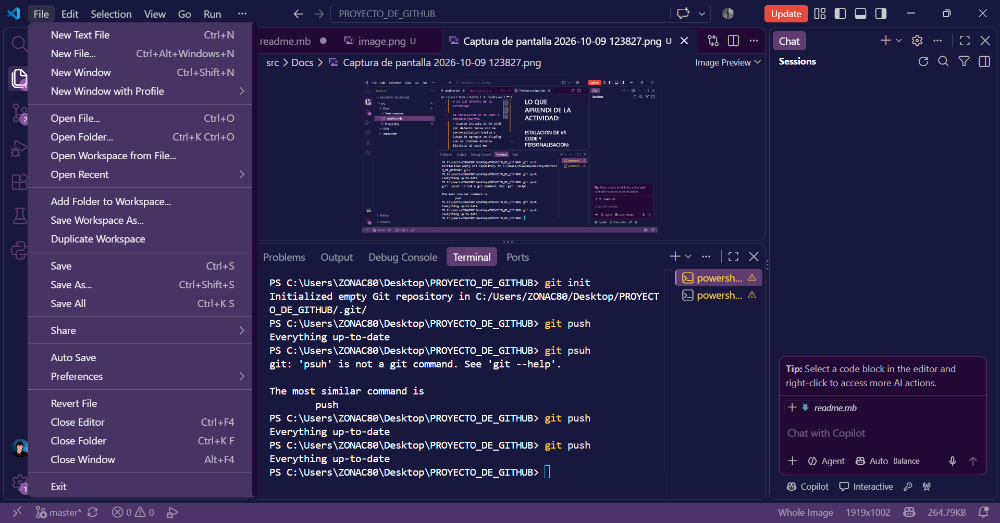
### Apartado de Archivo (file):
- Nos permite gestionar los documentos del proyecto. Contiene opciones para crear archivos de texto nuevos, abrir archivos o carpetas completas, guardar cambios y configurar autoservicios de guardado o cerrar ventanas.
---
### Apartado de Editar (Edit):
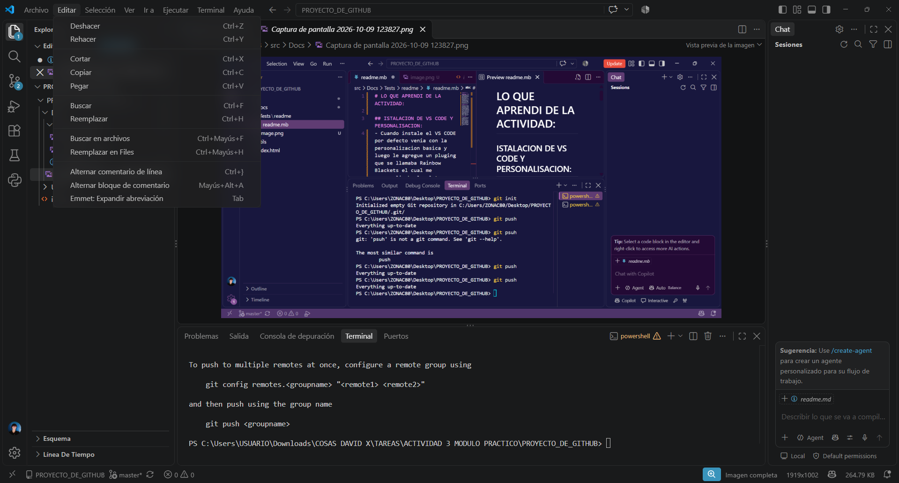
- Editar (Edit): Contiene herramientas para manipular texto dentro del editor. Incluye acciones como deshacer, rehacer, cortar, copiar, pegar, buscar palabras clave y reemplazar código en el documento.
---
### APARTADO DE SELECCIÓN:
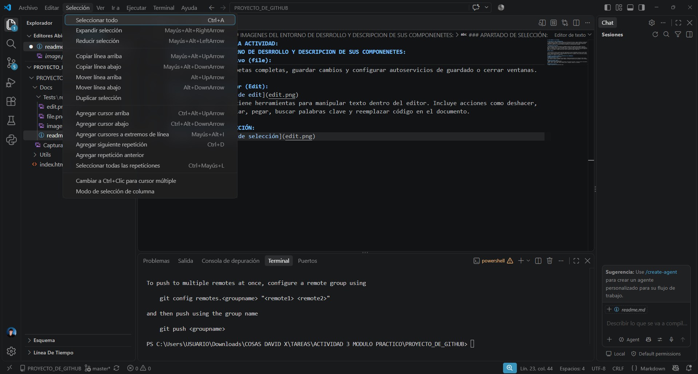
- Selección (Selection): Facilita la edición de múltiples líneas a la vez. Permite seleccionar todo el documento, expandir o encoger la selección actual y agregar cursores adicionales para editar varias áreas simultáneamente.
---
### APARTADO DE VER (VIEW):
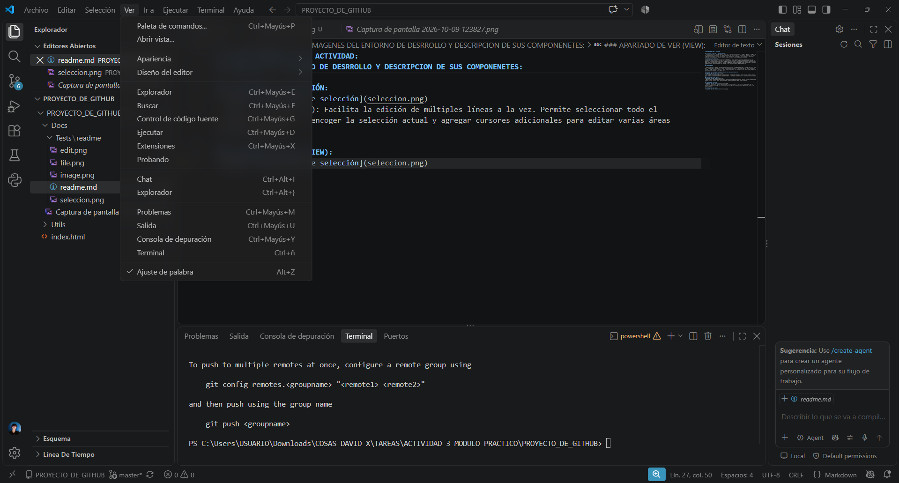
- Ver (View): Controla lo que se muestra u oculta en la interfaz. Permite abrir la terminal, mostrar o esconder paneles laterales, cambiar el tema de color y hacer zoom en la pantalla.
---
### APARTADO DE IR A (GO):
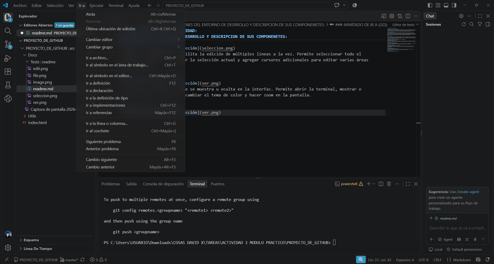
- Ir a (Go): Sirve para navegar de forma rápida por el proyecto. Incluye opciones para saltar directamente a una línea específica, buscar archivos por su nombre o moverse entre corchetes y definiciones de código.
---
### APARTADO DE EJECUTAR (RUN):
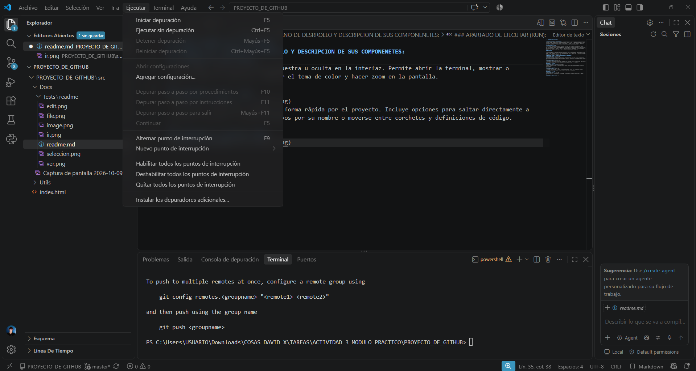
- Ejecutar (Run): Encargado de poner en marcha y probar el código. Permite iniciar el programa sin depurar, ejecutar en modo depuración (debugging) para buscar errores y añadir puntos de interrupción (breakpoints).
---
### APARTADO DE TERMINAL:
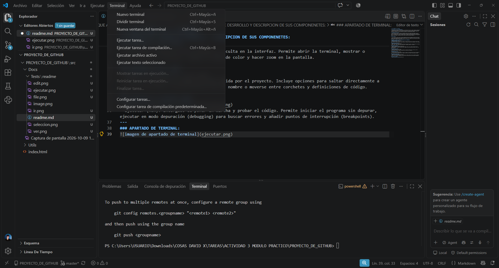
- Terminal: Permite abrir y administrar consolas de comandos integradas (como PowerShell o Bash) dentro de VS Code para ejecutar comandos de Git, instalaciones o scripts.
---
### APARTADO DE AYUDA (HELP):
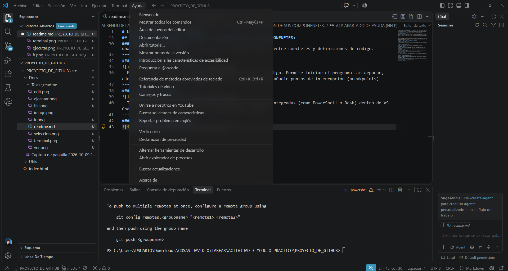
- Ayuda (Help): Ofrece acceso a la documentación oficial de VS Code, accesos directos de teclado, actualizaciones del programa y opciones para reportar problemas.
---
## BARRA DE ACTIVIDADES Y BREVE RESUMEN DE SUS FUNCIONES:

### EXPLORADOR (ICONO DE PAGINAS):
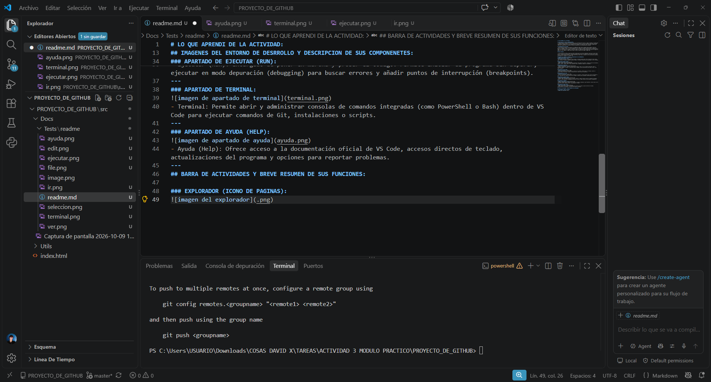
- Explorador (icono de páginas): Muestra el árbol de archivos y carpetas del proyecto actual. Permite crear, renombrar, mover y eliminar archivos fácilmente.
---
### BUSCAR (ICONO DE LUPA):
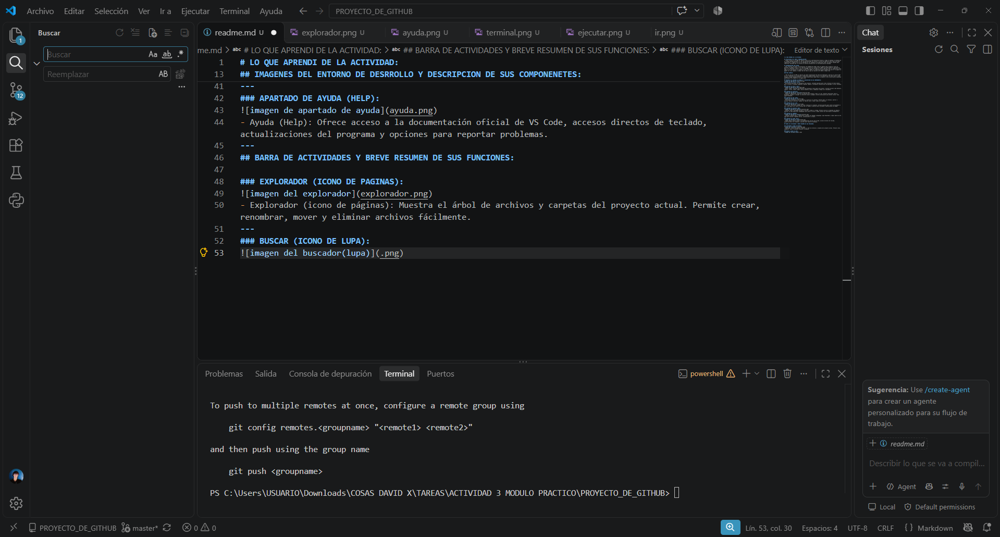
- Buscar (lupa): Permite buscar palabras o líneas de código en todos los archivos del proyecto a la vez y reemplazar el texto encontrado masivamente.
---
### CONTROL DE CODIGO FUENTE (ICONO DE RAMIFICACION/GIT):
-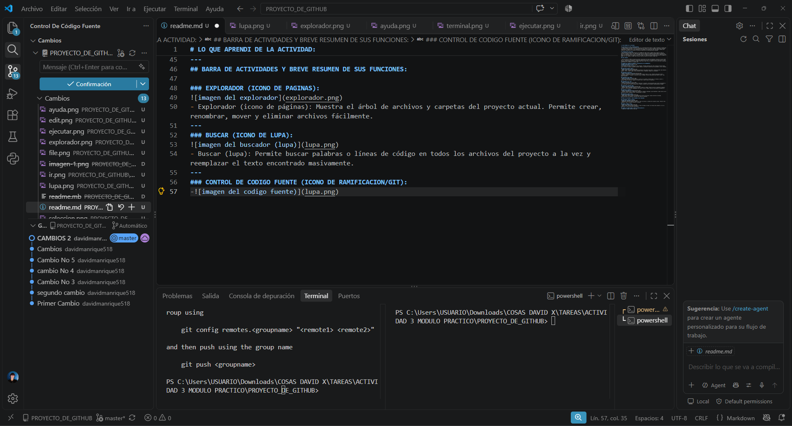
- Control de Código Fuente (icono de ramificación / Git): Muestra los cambios realizados en los archivos del proyecto, permite hacer confirmaciones (commits), crear ramas y sincronizar (publicar/subir) el trabajo con repositorios remotos como GitHub.
--- 
### EJECUTAR Y DEPURADOR (ICONO DE INSECTO CON BOTON DE PLAY):
-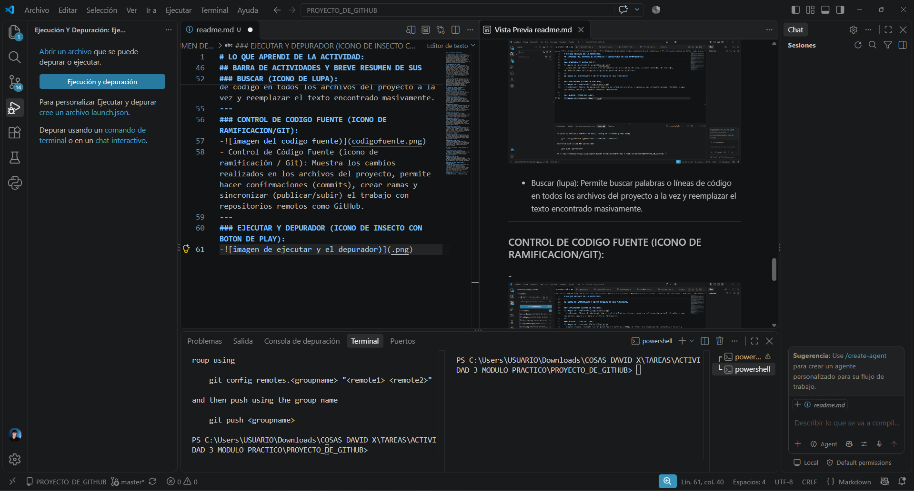
- Ejecutar y Depurar (icono de insecto con botón de play): Permite inspeccionar el código mientras se ejecuta, revisar el valor de las variables en tiempo real y pausar la ejecución para corregir errores.
---
### EXTENSIONES (ICONO DE CUADRADOS):
-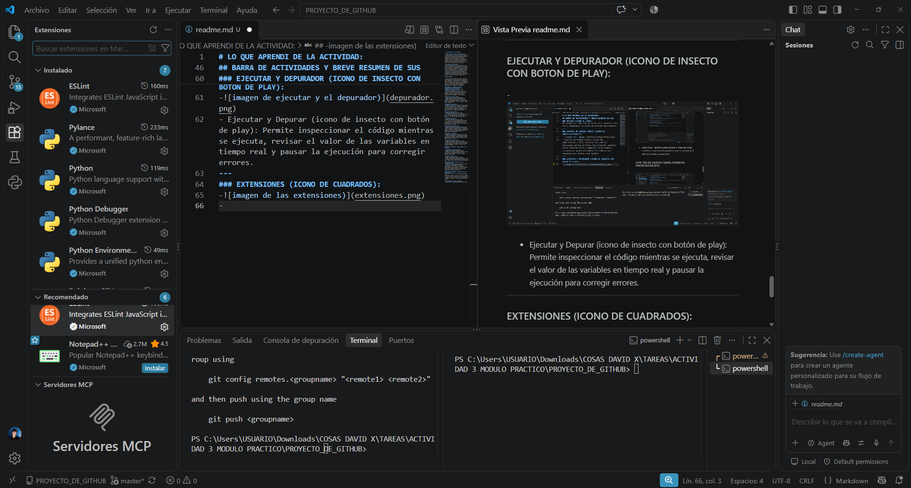
- Extensiones (icono de bloques / cuadrados): Es la tienda interna de VS Code para buscar e instalar complementos que añaden nuevas funciones como: soporte para lenguajes adicionales o temas visuales.
---
### PRUEBAS (ICONO DE TUBO CIENTIFICO):
-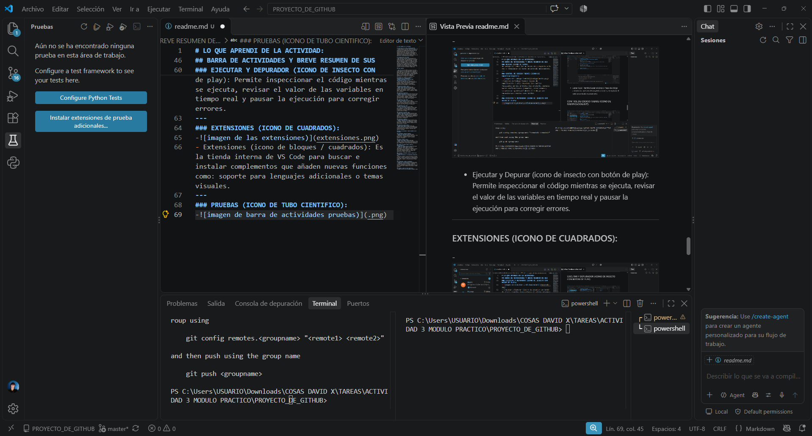
- Pruebas / Testing (icono del tubo cientifico): Es el apartado encargado de gestionar el análisis de calidad y funcionamiento del código. Permite descubrir, organizar y ejecutar pruebas unitarias automáticas sin tener que probar todo a mano. Muestra qué partes del proyecto pasaron la prueba correctamente y cuáles fallaron, permitiéndote solucionar fallos antes de subir el proyecto a producción o enviarlo a GitHub.
---
### PYTHON (ICONO OFICIAL DE PYTHON):
-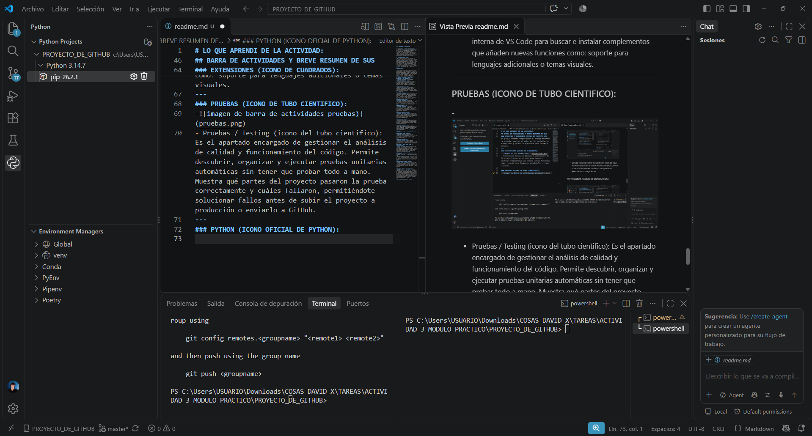
- Python (icono del lenguaje Python): Es una herramienta específica de la extensión de Python que permite gestionar entornos virtuales, seleccionar intérpretes y configurar proyectos basados en Python.
---
### IMAGENES DEL ENTONO DE DESARROLLO (IDE) PERSONALIZADO:
-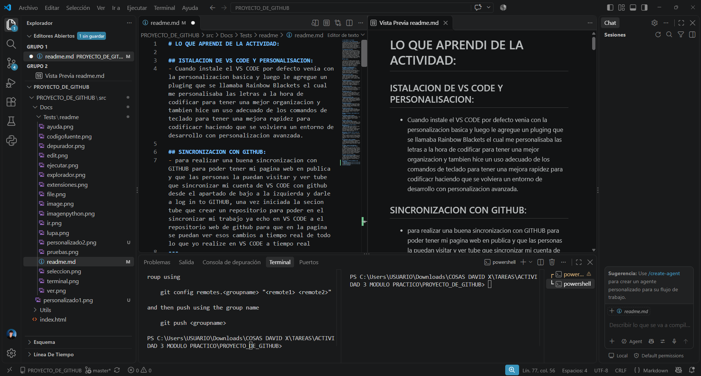
-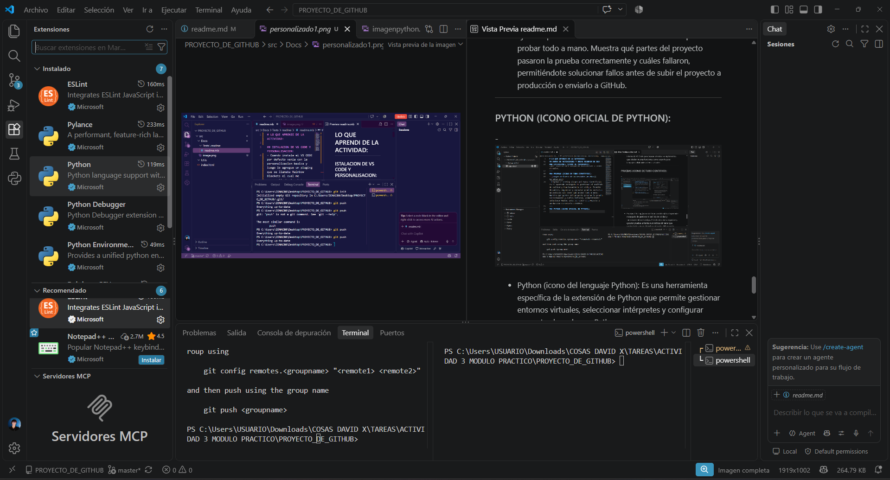

# fin de la actividad :)